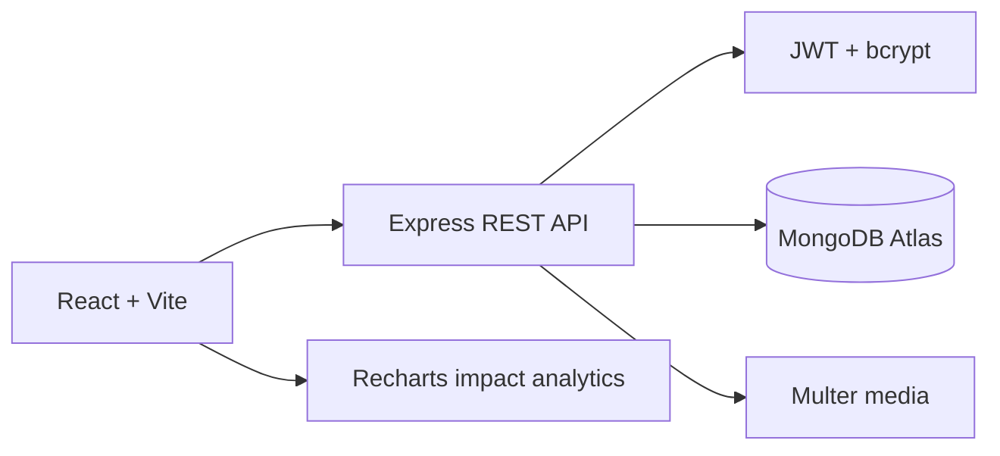
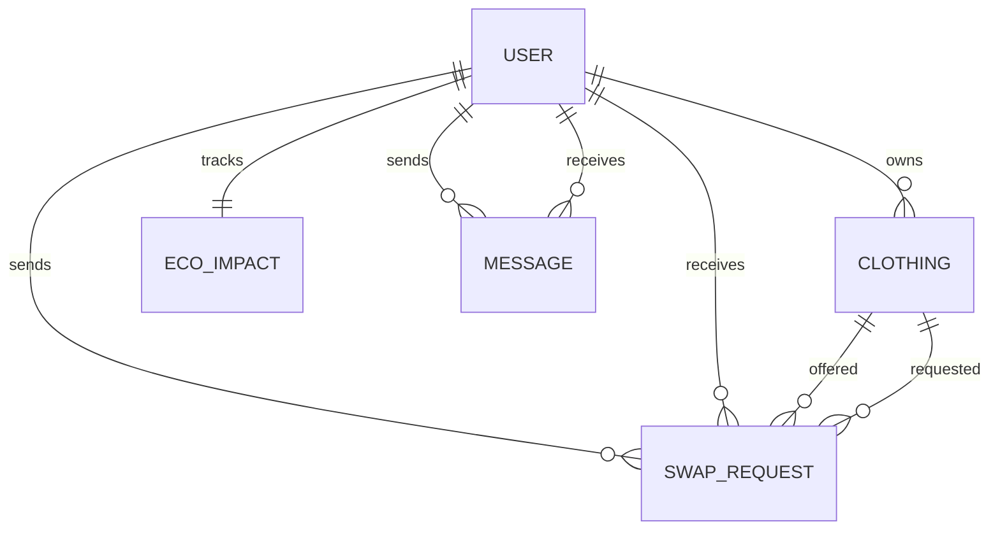
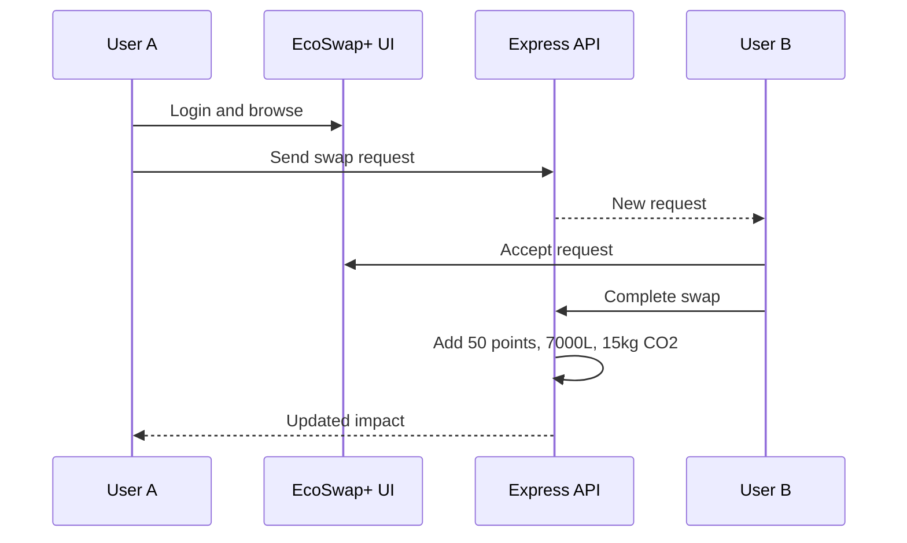

# EcoSwap+ – Sustainable Clothing Exchange Marketplace

## 1. Title
EcoSwap+ – Sustainable Clothing Exchange Marketplace.

## 2. Abstract
EcoSwap+ is a web marketplace for exchanging wearable clothing without money. Users list pieces, discover nearby clothing, compare swap value, negotiate, complete exchanges, and track water, carbon, textile, and points impact.

## 3. Introduction
Fast fashion creates avoidable textile waste. EcoSwap+ makes reuse convenient through a location-aware community closet and a transparent swap workflow.

## 4. Problem Statement
Existing fashion platforms prioritize purchase and resale. People need a simple exchange-first product for good clothing they no longer wear.

## 5. Objectives
Enable secure accounts, realistic listings, searchable discovery, compatible swap requests, negotiation, impact accounting, and moderation.

## 6. Existing System
Traditional e-commerce requires payment. Resale platforms require pricing, shipping, and seller fulfilment. Donation systems provide limited matching or feedback.

## 7. Proposed System
A barter marketplace with user profiles, clothing metadata, value comparison, location matching, swap states, chat, badges, and measurable environmental impact.

## 8. Features
Authentication, clothing CRUD, search and filters, item gallery, swap request lifecycle, chat, history, eco points, impact charts, leaderboard, challenges, admin analytics, responsive UI, dark mode, toasts, and validation.

## 9. Technology Stack
React, Vite, Tailwind CSS, Framer Motion, Recharts, Lucide React, Node.js, Express, MongoDB Atlas, Mongoose, JWT, bcrypt, Multer, Vercel, and Render.

## 10. System Architecture

## 11. Modules
Authentication, user/profile, clothing listing, browse/discovery, swap requests, chat, eco impact, leaderboard/challenges, and administration.

## 12. Database Design / ER Diagram

## 13. UML Diagrams

## 14. Screenshots
Capture the landing/dashboard, browse filters, item detail gallery, swap modal, chat, impact dashboard, leaderboard, and admin panel from the running URL `http://127.0.0.1:5173/`.

## 15. Testing
Verified in the running browser prototype: required login, two demo accounts, 124 listings, search/filter counts, item-specific gallery and related items, add listing, edit/delete listing, chat send, swap request, accept/reject/complete, impact increments, logout, and mobile layout without horizontal overflow. The API source was checked for diagnostics and the backend health route responds at `/api/health`. MongoDB-backed persistence and JWT registration/login require the environment variables in `backend/.env`.

## 16. Results
The prototype demonstrates a complete exchange-first workflow with in-session state and a MongoDB-ready API architecture. Completed swaps award +50 Eco Points, +7,000L water saved, and +15kg CO2 reduction in the live demo state.

## 17. Future Enhancements
WebSockets for real-time messaging, cloud media storage, email notifications, payment-free courier tracking, stronger moderation, and production analytics.

## 18. Conclusion
EcoSwap+ turns unused clothing into a local, measurable circular economy action. Its core experience is clear: list, discover, negotiate, exchange, and see the environmental result.

## 19. References
MongoDB documentation, Express documentation, React documentation, Vite documentation, JWT specification, Recharts documentation, and Multer documentation.
